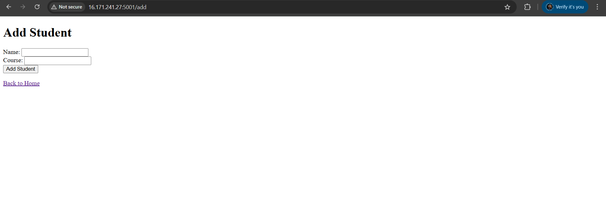

# 📦 Automate Docker Image Creation and Deployment using Jenkins Pipeline

## 🧾 Overview
This project demonstrates how to **automate Docker image creation and deployment** using a Jenkins pipeline, completely from **scratch**, without using pre-built images. It includes creating a local Docker registry, a Python Flask web app, Dockerizing it, and pushing the image through Jenkins CI/CD pipeline.

---

## 🧰 Tech Stack
- Jenkins (Installed from scratch using Docker)
- Docker & Docker Hub
- Local Docker Registry
- Python 3 / Flask
- GitHub
- EC2 (Ubuntu or RHEL)

---

## 📁 Project Structure

```
jenkins-docker-project/
├── app.py
├── Dockerfile
├── requirements.txt
└── templates/
    ├── index.html
    └── add.html
```

---

## 🔧 Setup Process

### 1. ✅ Install Docker on EC2
```bash
sudo apt update
sudo apt install docker.io
sudo systemctl start docker
sudo systemctl enable docker
```

---

### 2. 🧠 Install Jenkins from Scratch
Pulled the Jenkins Docker image and mapped ports:
```bash
docker run -d -p 8080:8080 -p 50000:50000 -v jenkins_home:/var/jenkins_home jenkins/jenkins
```

---

### 3. 🐍 Created Flask App

A simple Python Flask app to add and view student records with basic routes.

---

### 4. 🐳 Dockerized Flask App

**Dockerfile:**
```Dockerfile
FROM python:3.8-slim
WORKDIR /app
COPY requirements.txt requirements.txt
RUN pip install -r requirements.txt
COPY . .
EXPOSE 5000
CMD ["python", "app.py"]
```

To build and run:
```bash
docker build -t student-portal .
docker run -d -p 5001:5000 student-portal
```

---

### 5. 📦 Local Docker Registry
```bash
docker run -d -p 5000:5000 --name registry registry:2
```

Tag and push image:
```bash
docker tag student-portal localhost:5000/student-portal
docker push localhost:5000/student-portal
```

---

### 6. 🤖 Jenkins Pipeline Setup

Connected GitHub Repo and used the following Jenkins pipeline script:

```groovy
pipeline {
    agent any
    stages {
        stage('Clone Repo') {
            steps {
                git branch: 'main', url: 'https://github.com/shreya-singh27/flask-docker-app.git'
            }
        }
        stage('Build Docker Image') {
            steps {
                sh 'docker build -t student-portal .'
            }
        }
        stage('Tag Docker Image') {
            steps {
                sh 'docker tag student-portal localhost:5000/student-portal'
            }
        }
        stage('Push to Local Registry') {
            steps {
                sh 'docker push localhost:5000/student-portal'
            }
        }
    }
}
```

---

## 🖼️ Screenshots

> *(Place these images in an `images/` folder and refer like below in GitHub)*

### Add Student Form


### Student Added Confirmation


### API Student List


---

## 📎 GitHub Repo
[🔗 GitHub Link](https://github.com/shreya-singh27/flask-docker-app)

---

## 💡 What I Learned

- Installed and configured Jenkins and Docker from scratch
- Wrote a basic Flask app and Dockerized it
- Built a self-hosted Docker Registry
- Created a working CI/CD pipeline with GitHub + Jenkins + Docker
- Learned to solve permission issues, network port errors, Git branch handling, and Jenkins job configurations

---

> **Made everything from scratch — from setting up Jenkins to building and deploying the app with full automation.** 🚀
